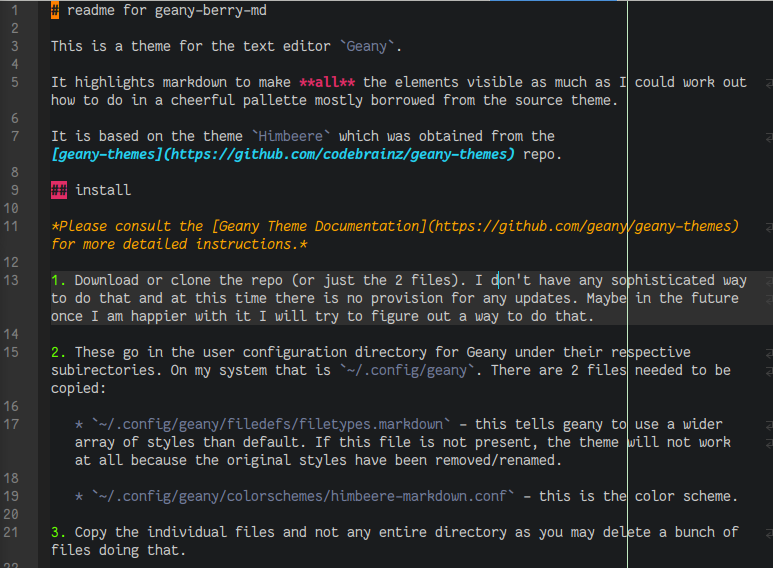

# readme for himbeere-markdown

This is a theme for the text editor `Geany`. 

It highlights markdown to make **all** the elements visible as much as I could work out how to do in a cheerful pallette mostly borrowed from the source theme. 

It is based on the theme `Himbeere` which was obtained from the [geany-themes](https://github.com/codebrainz/geany-themes) repo. 



## install

*Please consult the [Geany Theme Documentation](https://github.com/geany/geany-themes) for more detailed instructions.* 

1. Download or clone the repo (or just the 2 files). I don't have any sophisticated way to do that and at this time there is no provision for any updates. Maybe in the future once I am happier with it I will try to figure out a way to do that. 

2. These go in the user configuration directory for Geany under their respective subirectories. On my system that is `~/.config/geany`. There are 2 files needed to be copied:

   * `~/.config/geany/filedefs/filetypes.markdown` - this tells geany to use a wider array of styles than default. If this file is not present, the theme will not work at all because the original styles have been removed/renamed. 
   
   * `~/.config/geany/colorschemes/himbeere-markdown.conf` - this is the color scheme. 
	
3. Copy the individual files and not any entire directory as you may delete a bunch of files doing that. 

You should not be overwriting any files. If you are, it could be that you have already customized them for yourself so you may want to be careful before proceeding. 

## use 

After copying the files, go in Geany and select the menu `View` > `Change Color Scheme`. You should find the theme `Himbeere-Markdown` in there.

You may need to select `Tools` > `Reload Configuration` to apply it. 

## changes from the original

Compared to the original, I added the color `gold` into the pallette and renamed many of the relevant styles. 

The styles that apply to markdown have been differentiated instead of re-using the same style over and over for different elements. 

* [here is the diff](https://github.com/CouldBeThis/himbeere-markdown/commit/8139ae3ed0b9b9ce4278b2dccd7af1bdb578c311) comparing the original files to the first (at time of writing, only) version.

## wish list

I couldn't figure out how to do it but if it was possible it would be nice to style the whole block of text affected by a style. For example the entire heading instead of just the leading `#` or the entire blockquote instead of just `>`. 

Additionally it does not recognize lists very robustly. I like to put a tab (`\t`) at the start of my lists but the lexer will not pick it up if you do that. I don't belive either of these are likely solveable in the files I ahve workd on already. 

I am not happy with the exact way the colors are at the moment and plan to work on it as I use it more. 

I might add extra colorful support for other filetypes I use. 

## metadata

the information from the original file:

```conf
[theme_info]
name=Himbeere
description=A dark theme with raspberry colors.
# incremented automatically, do not change manually
version=1226
author=commenthol
url=https://github.com/codebrainz/geany-themes
# list of each compatible Geany release version
compat=1.22;1.23;1.23.1;1.24
```
